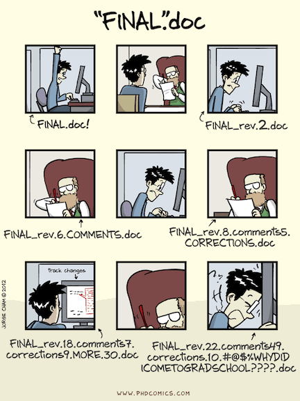
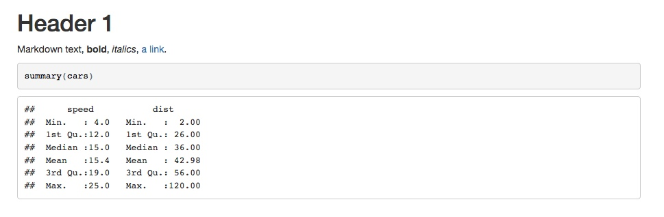
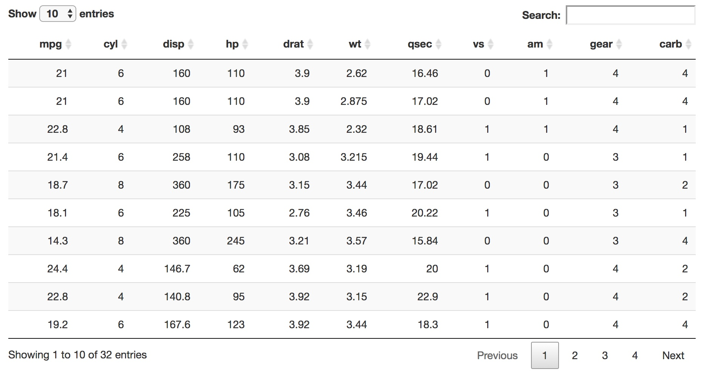

---
output:
  revealjs::revealjs_presentation:
    incremental: false
    self_contained: false
    lib_dir: libs
    center: true
    css: 
      - "assets/theme_white.css"
    transition: slide
    slide_level: 1
    reveal_plugins: ["notes"]
    includes:
      in_header: assets/header.html
---

```{r setup, include=FALSE}
knitr::opts_chunk$set(echo = TRUE)
options(width = 50)
```


# R Markdown


<aside class="notes" data-markdown>
</aside>

---

# What is<br>R Markdown? {data-background=#401F68}


<aside class="notes" data-markdown>
You may have seen the R Markdown file type when you go to make a new document in RStudio, or see documents with R code published online and have some awareness that they were made with this thing called R Markdown.

R Markdown is a way to write a document with executable R code in it.  

You may want to show both the code and the output, or you may just want to use R generate output that is integrated with other text or content, leaving out the R code.
</aside>

---

[Gallery](http://rmarkdown.rstudio.com/gallery.html)

[RPubs](https://rpubs.com/)

[Formatted Templates](https://github.com/juba/rmdformats)

[Research Computing Workshop](https://github.com/nuitrcs/rworkshops) [Files](https://nuitrcs.github.io/ggplotworkshop/ggplot.html)

---

# Why? {data-background=#401F68}

---

## Reproducible Workflows

---

[video](https://www.youtube.com/embed/s3JldKoA0zw?showinfo=0&rel=0)


---

## Version Control



<div class="caption">[Piled Higher and Deeper by Jorge Cham](http://phdcomics.com/comics/archive_print.php?comicid=1531)</div>

<aside class="notes" data-markdown>
R Markdown documents are plain text, so you can easily track changes with git or other version control systems.  

Previews in GitHub, or post html there
</aside>

---

## Multiple Versions


<div class="caption">[Source](http://rmarkdown.rstudio.com/authoring_quick_tour.html)</div>

<aside class="notes" data-markdown>
HTML for the web, pdf for distribution, Word for your coauthor to work with.  
</aside>


---

## Easy for you and your Audience


<aside class="notes" data-markdown>
Make your code and its output accessible to both people who may know R and people who don't.  You have the option to hide your code entirely (or use code folding).

I've had a number of students tell me that they use R or want to use R, but their advisor doesn't.  They don't want to send their advisor R code, but it can take a lot of time to reformat output, write it up, etc.  With R markdown, sharing is easier.

In my position, I may be sending results of an analysis to someone who is only interested in that -- but I don't have to do a separate write-up from my code.  I can have tables, multiple figures, notes -- everything in one place, in one document (can compile into a single, sharable document.
</aside>


---

## Multiple Audiences


<aside class="notes" data-markdown>
Lecture Notes

Assignments/Problem Sets

Internal vs. External

Create instructor versions with notes, assignment, and answer key versions of problem sets or lecture notes all from the same source document. 

Set which chunks of code or text will be displayed or evaluated with variables.  
</aside>
---

## Kindness to Future Self


<aside class="notes" data-markdown>
One important audience is your future self.

Typing comment lines in R can be cumbersome.  That approach works well for scripts, but for analysis, you need more words.

I'm guessing I'm not the only one who has opened up an old analysis script and had no idea what I was doing or thinking.  Why did I exclude those cases?  How did I decide on that model specification?

With R Markdown, writing text with the code is easy, which makes it more likely that you'll do it!
</aside>

---

# How does it work? {data-background=#401F68}

---


<div class="caption">Source: [R Markdown Website](http://rmarkdown.rstudio.com/lesson-2.html)</div>

<aside class="notes" data-markdown>

Markdown lets you write plain text, with some basic formatting.  

**R** Markdown lets you add chunks of R code to a markdown document.  

When you compile or "knit" the document, R Markdown then executes those code chunks and incorporates the output and results into a markdown document.  

That markdown document with the text, code, and results is then compiled into html (for the web), pdf, or Word document, in a variety of different formats.

</aside>

---

## R Markdown

<pre>
---
output:
  html_document:
    keep_md: true
---

# Header 1

Markdown text, **bold**, *italics*, 
[a link](http://google.com).

&#96;&#96;&#96;{r}
summary(cars)
&#96;&#96;&#96;
</pre>

---

## Markdown

<pre>
# Header 1

Markdown text, **bold**, *italics*, 
[a link](http://google.com).

&#96;&#96;&#96;r
summary(cars)
&#96;&#96;&#96;

&#96;&#96;&#96;
##      speed           dist       
##  Min.   : 4.0   Min.   :  2.00  
##  1st Qu.:12.0   1st Qu.: 26.00  
##  Median :15.0   Median : 36.00  
##  Mean   :15.4   Mean   : 42.98  
##  3rd Qu.:19.0   3rd Qu.: 56.00  
##  Max.   :25.0   Max.   :120.00
&#96;&#96;&#96;
</pre>

---

## HTML Code

<pre>
&lt;h1&gt;Header 1&lt;/h1&gt;

&lt;p&gt;Markdown text, &lt;strong&gt;bold&lt;/strong&gt;, 
&lt;em&gt;italics&lt;/em&gt;, 
&lt;a href="http://google.com"&gt;a link&lt;/a&gt;.&lt;/p&gt;

&lt;pre class="r"&gt;&lt;code&gt;summary(cars)&lt;/code&gt;&lt;/pre&gt;

&lt;pre&gt;&lt;code&gt;##      speed           dist       
##  Min.   : 4.0   Min.   :  2.00  
##  1st Qu.:12.0   1st Qu.: 26.00  
##  Median :15.0   Median : 36.00  
##  Mean   :15.4   Mean   : 42.98  
##  3rd Qu.:19.0   3rd Qu.: 56.00  
##  Max.   :25.0   Max.   :120.00&lt;/code&gt;&lt;/pre&gt;
&lt;/div&gt;
</pre>

---

# Header 1

Markdown text, **bold**, *italics*, 
[a link](http://google.com).

```{r}
summary(cars)
```

---



---


## Compilation Options

RStudio Knit Button 


`rmarkdown::render()`

---


<div class="caption">Source: [Heike Hofman](https://stat585-at-isu.github.io/materials/01_collaborative-environment/03_rmarkdown.html#)</div>


---

## YAML Header

Spacing matters

Look up the options: [R Markdown Formats](http://rmarkdown.rstudio.com/formats.html)

<aside class="notes" data-markdown>
Spacing - indentation, where colons and other punctuation are, etc. -- pay attention

You can override options set here with a call to render
</aside>

---

## Text Chunks: Markdown

```
# Header 1
## Header 2
### Header 3

*Italics*
**Bold**

[link text](http://google.com)
![caption][images/image.png]

- List Item 1
- List Item 2
  - Item 2a
  - Item 2b
  
1. Numbered list item 1
1. Numbered list item 2
```

<aside class="notes" data-markdown>
The second 1 in the numbered list isn't a typo -- makes it easier to reorder points

Markdown is also used on GitHub.  It's easy for including formatted code chunks.  It's plain text, but still gives you some formatting capabilities. 
</aside>

---


<div class="caption">Source: [Heike Hofman](https://stat585-at-isu.github.io/materials/01_collaborative-environment/03_rmarkdown.html#)</div>


---

## Options chunk

<pre>
&#96;&#96;&#96;{r setup, include=FALSE}
knitr::opts_chunk$set(echo = TRUE)
&#96;&#96;&#96;
</pre>

<aside class="notes" data-markdown>
This isn't necessarily required

and what's in this example doesn't change the default behavior
</aside>

---

## R chunks

<pre>
&#96;&#96;&#96;{r chunkname}
a<-2
a + 1
a<-3
a + 2
&#96;&#96;&#96;
</pre>

<aside class="notes" data-markdown>
chunk names will get auto generated if you don't set them

chunk names need to be unique -- can come up if automatically generating chunks (a bit of a hack)

if creating external figures, chunk names will get used

can make it easier to find errors
</aside>

---

```{r chunkname}
a<-2
a + 1
a<-3
a + 2
```

<aside class="notes" data-markdown>
Chunk was automatically divided
</aside>

---

## Plot

<pre>
&#96;&#96;&#96;{r, fig.width=8, echo=FALSE}
plot(cars)
&#96;&#96;&#96;
</pre>

---

```{r, fig.width=8, echo=FALSE}
plot(cars)
```

---

## Pretty Output with `knitr::kable`

---

```{r}
head(mtcars)
```

---

<pre>
&#96;&#96;&#96;{r, results='asis'}
library(knitr)
kable(head(cars))
&#96;&#96;&#96;
</pre>


```{r, echo=FALSE, results='asis'}
library(knitr)
kable(head(mtcars))
```

<aside class="notes" data-markdown>
kable creates table in format appropriate for output type

results asis prevents further processing of output
</aside>

---

```{r}
summary(lm(mpg ~ hp + disp, data=mtcars))
```

---


<pre>
&#96;&#96;&#96;{r, results='asis'}
reg1 <- lm(mpg ~ hp + disp, data=mtcars)
kable(summary(reg1)$coef, digits=2)
&#96;&#96;&#96;
</pre>


```{r, echo=FALSE, results='asis'}
reg1 <- lm(mpg ~ hp + disp, data=mtcars)
kable(summary(reg1)$coef, digits=2)
```

<aside class="notes" data-markdown>
other options/packages exist too: pander, xtable
</aside>

---

## Interactive Output<br>`DT::datatable`

<pre>
&#96;&#96;&#96;{r, echo=FALSE}
library(DT)
datatable(mtcars, rownames = FALSE)
&#96;&#96;&#96;
</pre>

---

```{r, echo=FALSE}
library(DT)
datatable(mtcars, rownames = FALSE)
```

---



---

# {data-background=#40e0d0}


---


# When not to use R Markdown {data-background=#401F68}

<i class="fa fa-thumbs-o-down fa-3x"></i>

---

## Long data processing and import scripts

<aside class="notes" data-markdown>
You can include scripts from R Markdown documents, but just keep a separate scripts file.
</aside>

---

## Long-running or complex calculations


<aside class="notes" data-markdown>
For long-running code, consider having a separate script pre-produce the data or output if you want to use R markdown for presentation.  You can knit/render the R markdown presentation file at the end of re-running your analysis to keep everything up to date.
</aside>
---

## Precise formatting required

<aside class="notes" data-markdown>
There are templates for a few journals and you can create your own, but markdown is intentionally limited in the formatting it allows.  

I sometimes see questions of "How do I do X in markdown?" and a legitimate answer to that question is often: "You don't"

You can use some html and LaTeX directly for special cases (this presentation for example has a custom CSS style sheet, uses the Reveal JS javascript package, and has some html code directly in the file)

But if you need precision control there are better ways.

You can still use many of the packages used by R markdown to produce well formatted tables and other output to include in your reports.

Still scripting, but a different approach to putting together a document.
</aside>


# R Notebooks {data-background=#401F68}

[Link](http://rmarkdown.rstudio.com/r_notebooks.html)

<aside class="notes" data-markdown>
Moving R Markdown documents in the direction of Jupyter notebooks, with code chunks and the resulting output directly underneath.

Also adding some formatting and display "magic" and niceness automatically

Advantages are that you can see everything together

But I've found my workflow not to be as smooth, and the experience of using R Notebooks to not quite be 100% yet.  

A different approach of having everything in the notebook file, versus composing a document where you might be selective about what's included.
</aside>


<aside class="notes" data-markdown>

</aside>


